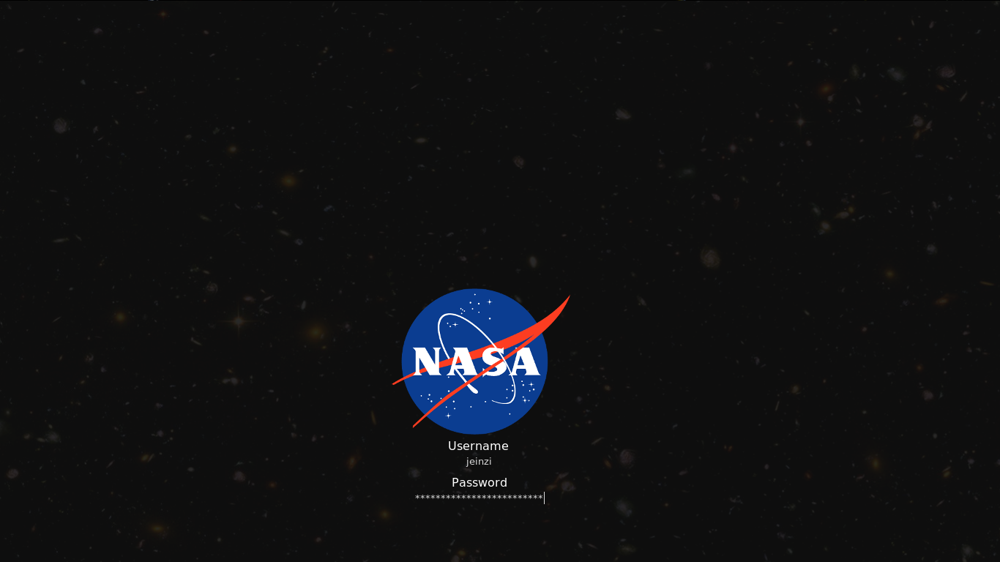
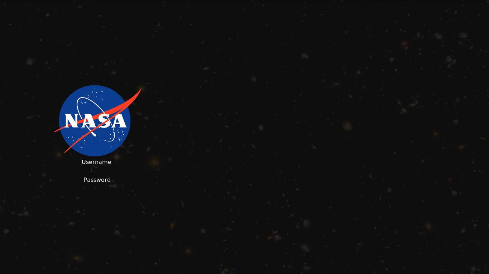
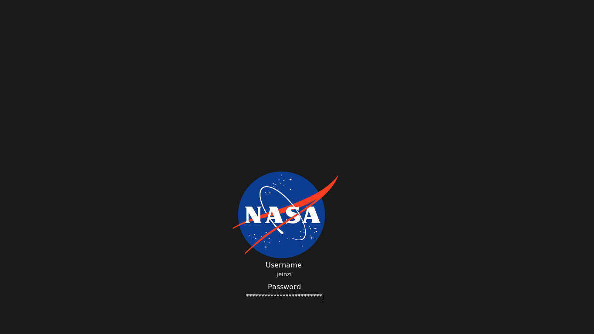

# NASA SLiM theme
A [SLiM](https://wiki.archlinux.org/index.php/SLiM) theme with a NASA logo on a star-filled background. Alternatively, a gray background can be used.

For me, as I work with two monitors at home and also carry my laptop around quite a bit, it is somewhat important that the login screen looks neat in both situations. So this theme works with either one or two monitors. (At least with a bit of tweaking to adapt to the given resolutions)

## Examples
The theme with stars as background, on a machine with only one monitor.

Works as well as with two screens, whereas only the main screen is shown here:

Same with a gray background, using one monitor...

... and two monitors.

